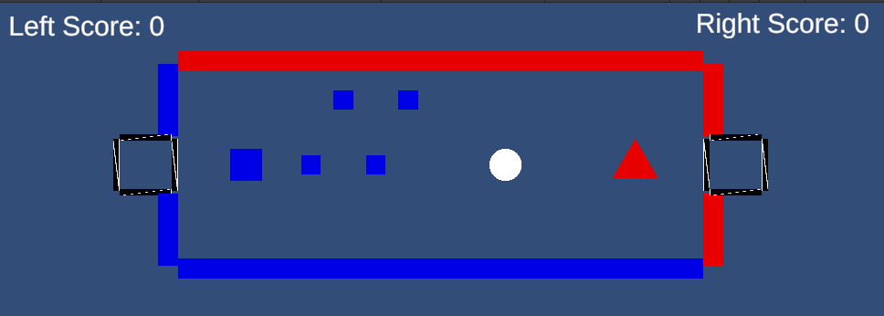

ゲーム制作技術総合実習 個人ワーク
（Circle, Triangle, Squareを使用した2Dゲーム）

# Crazy Hockey

## ゲームの内容
△のオブジェクトを自分で操作し、〇のオブジェクトを相手ゴールに入れるエアホッケーゲーム。□のオブジェクトは、決めたポイント間を往復する動きをする。〇のオブジェクトが、△または□に当たった時にホッケーのように滑って移動する。

## 操作説明
 - W,A,S,Dのキーを押すと、それぞれ上、左、下、右に動く。
 - Mキーを押すとMenu画面に飛び、もう一回遊ぶか、タイトルに選ぶかを選べる。
